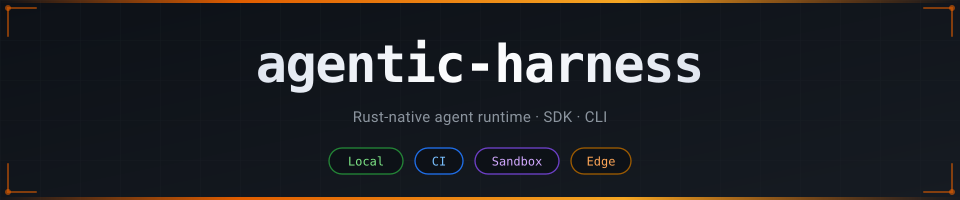

<div align="center">
  
</div>

<br>

<div align="center">

[](LICENSE)
[](https://www.rust-lang.org)
[](https://github.com/codejunkie99/agentic-harness/releases)
[](docs/)

</div>

<p align="center">
  Build agents that read a repo, plan, edit files, run tests, and report back —<br>
  then ship the <em>same binary</em> to your laptop, CI, a remote Linux sandbox, or the edge.<br>
  <sub>Native Rust end to end. No JavaScript anywhere.</sub>
</p>

<br>

---

## Architecture

<div align="center">
  
</div>

> Full docs live in [`docs/`](docs/). Architecture, execution targets, runtime config,
> HTTP SessionEnv protocol, Cloudflare runtime, deployment guides, feature status, and
> release notes — all there.

---

## Install

<details open>
<summary><b>Tarball &nbsp;·&nbsp; recommended</b></summary>
<br>

```bash
curl -L -o agentic-harness-v0.1.1.tar.gz \
  https://github.com/codejunkie99/agentic-harness/archive/refs/tags/v0.1.1.tar.gz
tar -xzf agentic-harness-v0.1.1.tar.gz
cd agentic-harness-0.1.1
./scripts/install.sh
export PATH="$HOME/.agentic-harness/bin:$PATH"
agentic-harness --version
```

</details>

<details>
<summary><b>Source checkout</b></summary>
<br>

```bash
git clone https://github.com/codejunkie99/agentic-harness.git
cd agentic-harness
./scripts/install.sh
export PATH="$HOME/.agentic-harness/bin:$PATH"
agentic-harness --version
```

</details>

<details>
<summary><b>Homebrew</b></summary>
<br>

```bash
HOMEBREW_DEVELOPER=1 brew install --formula --build-from-source \
  ./Formula/agentic-harness.rb
agentic-harness --version
```

> Use `--HEAD` only when you explicitly want the latest `main` instead of the tagged release.

</details>

Set `AGENTIC_HARNESS_PREFIX` to install somewhere other than `$HOME/.agentic-harness`.

---

## Quick Start

| Goal | Command |
|------|---------|
| **Use the harness on a repo** | `agentic-harness guide`, then `agentic-harness code --workspace . --llm auto` |
| **Create a new agent project** | `agentic-harness new ./my-agent --template coding` |
| **Serve an existing agent** | `agentic-harness setup hosting --workspace .`, then `agentic-harness host --workspace .` |
| **Build for deployment** | `agentic-harness build --target native\|node\|cloudflare` |
| **Embed the SDK** | `use agentic_harness::prelude::*;` |

---

## Core Concepts

| Abstraction | Description |
|-------------|-------------|
| **`AgentApp`** | Root registry — wire handlers, load workspace context, spawn the runtime |
| **`Session`** | Persistent conversation with a model, scoped to an agent invocation + ID |
| **`Task`** | One-shot child session with fresh history; shares the workspace |
| **`Role`** | Per-call system-prompt overlay, loaded from `.agentic-harness/roles/` |
| **`Skill`** | Auto-discovered behavior descriptor in workspace Markdown |
| **`SessionEnv`** | Execution environment: local, `HttpSessionEnv` (remote sandbox), or Workers |
| **`ModelClient`** | Provider-neutral trait — swap backends without touching handlers |
| **`Connector`** | Recipe for wiring a third-party sandbox, MCP server, or model gateway |

Agent identity is the URL path: `POST /agents/<name>/<id>` — reuse `<id>` to continue a
session, use a new one to start fresh.

---

## Coding Agent Loop

<div align="center">
  
</div>

```bash
agentic-harness code --workspace . --llm auto \
  --prompt "Add a flag to skip the network call in test mode" \
  --deny-path .env \
  --approve-dependencies \
  --commit "feat: --offline flag" \
  --pr
```

Each run writes `.agentic-harness/runs/<id>/` — `coding-brief.md`, `summary.md`,
`run.json`, `events.jsonl`, `diff.patch`, `checks.json`, `agent-instructions.md`.

---

## Examples

<details>
<summary><b>Quickstart — minimal webhook agent</b></summary>
<br>

```rust
use agentic_harness::prelude::*;
use serde::Deserialize;
use serde_json::json;

#[derive(Deserialize)]
struct HelloPayload { name: Option<String> }

fn app() -> Result<AgentApp, AgenticHarnessError> {
    Ok(AgentApp::new()
        .with_workspace(".")
        .load_workspace_context()?
        .agent(AgentDefinition::webhook("hello", |ctx: AgentContext| {
            let payload: HelloPayload = ctx.payload()?;
            let name = payload.name.unwrap_or_else(|| "World".to_string());
            Ok(json!({ "id": ctx.id(), "message": format!("Hello, {name}!") }))
        })))
}

fn main() {
    std::process::exit(app().and_then(run_cli).unwrap_or(1));
}
```

```bash
agentic-harness new ./my-agent --template hello
agentic-harness run hello --workspace ./my-agent --id demo --payload '{"name":"Ada"}'
```

Use `--template coding`, `code-review`, `test-fixer`, `docs-writer`, `repo-analyst`,
or another built-in template when you want a fuller software-agent starter.

</details>

<details>
<summary><b>CI snapshot repair — bless safe snapshot diffs automatically</b></summary>
<br>

```rust
fn app() -> Result<AgentApp, AgenticHarnessError> {
    Ok(AgentApp::new()
        .with_workspace(".")
        .load_workspace_context()?
        .agent(AgentDefinition::cli("snapshot-repair", |ctx: AgentContext| {
            let Payload { failing } = ctx.payload()?;
            let session = ctx.session_with_id(ctx.id());

            let report = session.prompt_with_options(
                format!(
                    "Review these failing snapshots and bless only the safe ones:\n\n{}",
                    failing.join("\n"),
                ),
                PromptOptions::new().role("snapshot-reviewer"),
            )?;

            Ok(json!({ "report": report.text() }))
        })))
}
```

```bash
SNAPS=$(find . -name '*.snap.new' | jq -Rsc 'split("\n") | map(select(length>0))')
agentic-harness run snapshot-repair --workspace . --id "ci-$RUN" \
  --payload "{\"failing\":$SNAPS}"
```

</details>

<details>
<summary><b>Parallel tasks — codebase cartographer</b></summary>
<br>

Fan out one `session.task()` per top-level module, merge the results into `ARCHITECTURE.md`:

```rust
let mut sections = Vec::new();
for entry in session.readdir(&src)?.into_iter().filter(|e| e.is_dir) {
    let child = session.task_with_id(
        format!("module-{}", entry.name),
        format!(
            "Summarize the public surface of {src}/{name}. \
             List entry points and cross-module imports.",
            src = src, name = entry.name,
        ),
        TaskOptions::new().role("module-summarizer"),
    )?;
    sections.push(format!("## {}\n\n{}\n", entry.name, child.text()));
}
session.write("ARCHITECTURE.md", &sections.join("\n"))?;
```

</details>

<details>
<summary><b>Remote sandbox — Linux reproducer over HttpSessionEnv</b></summary>
<br>

The agent stays a native Rust binary on your laptop; shell and file operations
run on the other side of an HTTP boundary.

```rust
use agentic_harness::HttpSessionEnv;

let sandbox = HttpSessionEnv::new(std::env::var("SANDBOX_URL")?, "/workspace")
    .header("Authorization", format!("Bearer {}", std::env::var("SANDBOX_TOKEN")?));

let session = ctx.session_with_id_and_env("repro", sandbox);
session.shell("git clone {repo} /workspace/repo && git -C /workspace/repo checkout {branch}")?;
let probe = session.shell("cd /workspace/repo && cargo test --no-fail-fast 2>&1 | tail -200")?;
session.write("/workspace/repro-report.md",
    &format!("## exit: {}\n\n```\n{}\n```\n", probe.status, probe.stdout))?;
```

```bash
agentic-harness setup sandbox --target e2b --endpoint $SANDBOX_URL
agentic-harness sandbox exec "uname -a && rustc --version" --json
```

</details>

<details>
<summary><b>MCP tools — Sentry integration</b></summary>
<br>

```rust
use agentic_harness::McpServerOptions;

let sentry = ctx.connect_mcp(
    "sentry",
    McpServerOptions::new("https://mcp.sentry.io/mcp")
        .header("Authorization", format!("Bearer {}", std::env::var("SENTRY_TOKEN")?)),
)?;

let session = ctx.session_with_id(ctx.id()).with_tools(sentry);
let plan = session.prompt(
    "Find the highest-volume new error in the last 24h, locate the commit that \
     introduced it, and draft a hot-fix plan with rollback steps.",
)?;
```

</details>

<details>
<summary><b>Schema-guided output — typed <code>cargo audit</code> results</b></summary>
<br>

```rust
#[derive(Deserialize)]
struct CrateAudit {
    advisories: Vec<Advisory>,
    risk: Risk,
    next_action: String,
}

let audit: CrateAudit = session.prompt_json_with_options(
    "Run `cargo audit`, group by severity, pick the smallest safe upgrade plan.",
    PromptOptions::new().result_schema(json!({
        "type": "object",
        "required": ["advisories", "risk", "next_action"],
        "properties": {
            "advisories": { "type": "array", "items": { "type": "object",
                "properties": { "id": {"type":"string"}, "package": {"type":"string"},
                  "severity": {"enum":["low","medium","high","critical"]} } } },
            "risk": { "enum": ["none","low","medium","high","critical"] },
            "next_action": { "type": "string" }
        }
    })),
)?;
```

Built-in `---RESULT_START---` / `---RESULT_END---` extraction means the model can
return reasoning prose alongside the typed payload — no manual JSON wrangling.

</details>

---

## Sessions, Tasks & Roles

```bash
# Start a session
curl http://localhost:3583/agents/hello/session-abc \
  -H "Content-Type: application/json" -d '{"name":"Ada"}'

# Continue the same session (same id)
curl http://localhost:3583/agents/hello/session-abc \
  -H "Content-Type: application/json" -d '{"name":"Ada"}'

# New session (new id)
curl http://localhost:3583/agents/hello/session-xyz \
  -H "Content-Type: application/json" -d '{"name":"Ada"}'
```

**Tasks** run a focused one-shot child agent with fresh history, sharing the workspace:

```rust
let research = session.task(
    "Research the auth flow and summarize the key files.",
    TaskOptions::new().role("researcher"),
)?;
let plan = session.prompt(format!(
    "Use this research to draft the implementation plan:\n\n{}", research.text()
))?;
```

**Roles** live in `.agentic-harness/roles/`, **Skills** in `.agents/skills/` — both
auto-discovered. Precedence: *call role > session role > agent role*, applied as
call-scoped system-prompt overlays that never pollute persisted message history.

**Automatic compaction** keeps long-running sessions inside a context budget:

```rust
let response = session.prompt_with_options(
    "Continue from the current plan.",
    PromptOptions::new().compaction(
        CompactionSettings::new()
            .context_window_tokens(128_000)
            .reserve_tokens(16_384)
            .keep_recent_messages(12),
    ),
)?;
```

---

## CLI Reference

| Command | Description |
|---------|-------------|
| `agentic-harness guide` | Interactive TUI — guided front door |
| `agentic-harness code` | Run the coding-agent loop on a workspace |
| `agentic-harness new <path>` | Scaffold a new agent project from a template |
| `agentic-harness dev` | Watch-mode dev server with auto-reload |
| `agentic-harness run <name>` | One-shot CLI invocation of any agent |
| `agentic-harness serve` | Start the HTTP server (production mode) |
| `agentic-harness host` | Long-running local server from `hosting.toml` |
| `agentic-harness build` | Build for `--target native`, `node`, or `cloudflare` |
| `agentic-harness doctor` | Workspace readiness check |
| `agentic-harness dashboard` | Status, templates, recent runs, next steps |
| `agentic-harness inspect` | Read latest coding-run summary |
| `agentic-harness sandbox` | Manage remote Linux sandboxes |
| `agentic-harness add` | Add a connector recipe |
| `agentic-harness smoke` | Post-install end-to-end check |
| `agentic-harness package` | Stage release packages with manifest and checksums |

**Connectors** are recipes you pipe to your coding agent — it writes the small Rust
adapter for you:

```bash
agentic-harness add                      # list available connectors
agentic-harness add daytona | claude     # pipe to your coding agent
agentic-harness add e2b     | codex
agentic-harness add https://e2b.dev/docs --category sandbox | claude
```

---

## Why Rust

- **One toolchain** — `cargo` builds, tests, ships, and runs everything. No bundler,
  transpile step, or language runtime to install on the target.
- **One artifact** — self-contained native executable plus `manifest.json`.
- **Typed end-to-end** — handler boundaries have compile-time checking;
  `ModelClient` is a trait, so providers swap without touching handlers.
- **Easy to test** — file/search/edit/shell helpers are ordinary Rust methods.
  The suite covers SDK behavior, CLI behavior, generated build artifacts,
  env-file loading, session persistence, and HTTP route behavior.

---

## Workspace

| Crate | Contents |
|-------|----------|
| [`crates/agentic-harness`](crates/agentic-harness) | SDK — agent registry, context, sessions, roles, skills, tools, HTTP serving |
| [`crates/agentic-harness-cli`](crates/agentic-harness-cli) | CLI — `wizard`, `code`, `new`, `template`, `setup`, `doctor`, `build`, `dev`, `run`, `serve`, `manifest`, `add` |
| [`examples/hello-world`](examples/hello-world) | Native Rust example agent workspace |

---

## Documentation

| Doc | Description |
|-----|-------------|
| [docs/README.md](docs/README.md) | Documentation index — start here |
| [execution-targets.md](docs/execution-targets.md) | Local / CI / sandbox / Cloudflare target details |
| [runtime-config.md](docs/runtime-config.md) | Provider defaults and model registration |
| [http-session-env.md](docs/http-session-env.md) | HttpSessionEnv wire format for remote sandboxes |
| [cloudflare-runtime.md](docs/cloudflare-runtime.md) | Worker boundary, Durable Objects, adapter ABI |
| [deploy-node.md](docs/deploy-node.md) | Node hosting around the native binary |
| [connectors.md](docs/connectors.md) | Sandbox connector helpers |
| [virtual-sandbox.md](docs/virtual-sandbox.md) | Hostless in-memory filesystem and shell subset |
| [feature-status.md](docs/feature-status.md) | What's shipped, with code/test/doc evidence |
| [immediate-goals.md](docs/immediate-goals.md) | Roadmap and non-goals |
| [release-smoke-test.md](docs/release-smoke-test.md) | Pre-publish checklist |

---

## Development

```bash
cargo fmt --all --check
cargo test --workspace
cargo clippy --workspace -- -D warnings
```

---

## License

[LICENSE](LICENSE)
