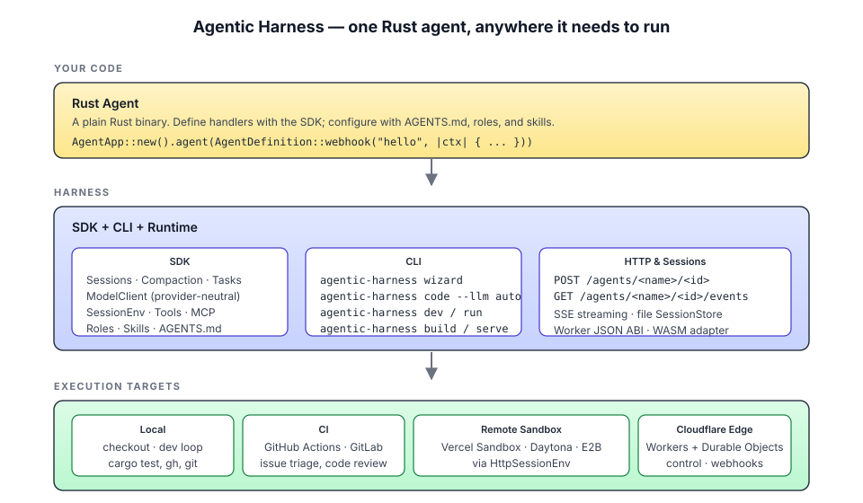

# Agentic Harness

**The Rust agent harness.** Build agents that read a repo, plan, edit files, run
tests, and report back — then ship the same binary to your laptop, CI, a remote
Linux sandbox, or the edge.

If you've used Claude Code, Codex, or Cursor, you already know how this feels:
an agent loop with sessions, tools, skills, and a workspace it can act on. The
difference is that it's headless, programmable, and yours. Agents are plain Rust
binaries; their behavior — `AGENTS.md`, roles, and skills — lives in Markdown,
so you change what an agent does without touching the build.

Native Rust end to end: SDK, CLI, runtime, HTTP dispatch, sessions, tools,
workspace context. One toolchain, one self-contained binary, no JavaScript
anywhere. Runs locally on a checkout or in CI, talks to remote Linux sandboxes
(Vercel Sandbox, Daytona, E2B) over a small HTTP protocol, and emits a
Cloudflare Workers boundary for edge control planes.



> 📚 **Documentation lives in [`docs/`](docs/).** Architecture, execution
> targets, runtime config, HTTP SessionEnv protocol, Cloudflare runtime,
> deployment guides, feature status, and release notes — all there.

## Start Here

Pick the path that matches what you are trying to do:

- **Use the tool on a repo:** run `agentic-harness guide`, then
  `agentic-harness code --workspace . --llm auto`.
- **Create a Rust agent project:** run
  `agentic-harness new ./my-agent --template coding`, then
  `agentic-harness dev --workspace ./my-agent`.
- **Serve an existing agent:** run `agentic-harness setup hosting --workspace .`
  once, then `agentic-harness host --workspace .`.
- **Ship to a host:** use `agentic-harness build --target native` for a native
  binary, `--target node` for Node platforms, or `--target cloudflare` for the
  Worker boundary artifacts described in
  [`docs/cloudflare-runtime.md`](docs/cloudflare-runtime.md).
- **Embed the SDK:** use `AgentApp`, `AgentDefinition`, `AgentContext`, and
  `run_cli` from `agentic_harness::prelude::*`.

## Workspace

- [`crates/agentic-harness`](crates/agentic-harness): Rust SDK for the agent
  registry, context, sessions, roles, skills, tools, and HTTP serving.
- [`crates/agentic-harness-cli`](crates/agentic-harness-cli): Rust CLI for
  `wizard`, `code`, `new`, `template`, `setup`, `doctor`, `build`, `dev`, `run`,
  `serve`, `manifest`, and `add`.
- [`examples/hello-world`](examples/hello-world): Native Rust example agent
  workspace.

## Install

```bash
git clone https://github.com/codejunkie99/agentic-harness
cd agentic-harness
./scripts/install.sh
export PATH="$HOME/.agentic-harness/bin:$PATH"
agentic-harness --version
```

Homebrew HEAD installs are also available via
[`Formula/agentic-harness.rb`](Formula/agentic-harness.rb).

## Common Commands

```bash
agentic-harness guide --workspace . --env codex
agentic-harness doctor --workspace . --json
agentic-harness dashboard --workspace . --plain
agentic-harness code --workspace . --llm auto --prompt "Fix the failing tests"
agentic-harness inspect --workspace .
```

`doctor` checks readiness, `dashboard` summarizes the workspace, `code` runs the
coding-agent loop, and `inspect` reads the latest coding-run summary.

## Examples

### Quickstart

The simplest agent — no sandbox config, no model wiring, just a typed payload
and a JSON response. Run it as a CLI or serve it over HTTP.

```rust
// src/main.rs
use agentic_harness::prelude::*;
use serde::Deserialize;
use serde_json::json;

// Every agent has a trigger. This one is invoked as an HTTP webhook.
#[derive(Deserialize)]
struct HelloPayload {
    name: Option<String>,
}

fn app() -> Result<AgentApp, AgenticHarnessError> {
    Ok(AgentApp::new()
        .with_workspace(".")
        .load_workspace_context()?
        .agent(AgentDefinition::webhook("hello", |ctx: AgentContext| {
            let payload: HelloPayload = ctx.payload()?;
            let name = payload.name.unwrap_or_else(|| "World".to_string());
            Ok(json!({
                "id": ctx.id(),
                "message": format!("Hello, {name}!"),
            }))
        })))
}

fn main() {
    let code = match app().and_then(run_cli) {
        Ok(code) => code,
        Err(err) => {
            eprintln!("[agentic-harness] {err}");
            1
        }
    };
    std::process::exit(code);
}
```

```bash
agentic-harness new ./my-agent --template hello
agentic-harness run hello --workspace ./my-agent --id demo \
  --payload '{"name":"Ada"}'
```

Use `--template coding`, `code-review`, `test-fixer`, `docs-writer`,
`repo-analyst`, or another built-in template when you want a fuller software
agent starter instead of the minimal hello-world shape.

### Coding Agent (Local Repo)

The flagship workflow. `agentic-harness start` opens the guided TUI front door;
`agentic-harness code` is the direct automation path. The coding loop inspects
the repo, reads `AGENTS.md` / `CLAUDE.md`, captures git diff context, drafts a
plan, hands the brief to your installed coding LLM, runs detected checks
(`cargo test`, etc.), and optionally commits or opens a PR. No prompt? It
defaults to a sensible "smallest safe step" brief.

```bash
# Detects whichever of claude / codex / cursor / wind-server you have
agentic-harness code --workspace . --llm auto \
  --prompt "Add a flag to skip the network call in test mode" \
  --deny-path .env \
  --approve-dependencies \
  --commit "feat: --offline flag" \
  --pr
```

The harness writes a run-scoped brief to
`.agentic-harness/runs/<id>/coding-brief.md`, streams progress, captures the
agent result, and saves both latest summaries and a durable bundle under
`.agentic-harness/runs/<id>/` (`summary.md`, `run.json`, `events.jsonl`,
`diff.patch`, `checks.json`, `agent-instructions.md`). Policy flags such as
`--allow-path`, `--deny-path`, `--max-command-risk`, and
`--approve-dependencies` gate code mutation before commit or PR handoff.

### Snapshot Repair (CI)

A CLI-only agent that runs in CI after `cargo test` produces failing
`*.snap.new` files. It reads the diffs, decides which are safe to bless under a
workspace policy (additive output, ordering changes, whitespace), applies the
safe ones, and flags the rest for human review. No HTTP trigger.

```rust
// src/main.rs
use agentic_harness::prelude::*;
use serde::Deserialize;
use serde_json::json;

#[derive(Deserialize)]
struct Payload {
    failing: Vec<String>, // paths to *.snap.new files
}

fn app() -> Result<AgentApp, AgenticHarnessError> {
    Ok(AgentApp::new()
        .with_workspace(".")
        .load_workspace_context()?
        .agent(AgentDefinition::cli("snapshot-repair", |ctx: AgentContext| {
            let Payload { failing } = ctx.payload()?;
            let session = ctx.session_with_id(ctx.id());

            // The "snapshot-reviewer" role lives in .agentic-harness/roles/.
            // It tells the model what counts as a safe bless vs. a human-only call.
            let report = session.prompt_with_options(
                format!(
                    "Review these failing snapshots and bless only the safe ones:\n\n{}",
                    failing.join("\n"),
                ),
                PromptOptions::new().role("snapshot-reviewer"),
            )?;

            Ok(json!({ "report": report.text() }))
        })))
}

fn main() { std::process::exit(app().and_then(run_cli).unwrap_or(1)); }
```

```bash
# In CI, after a failed test run, hand the new snapshots to the agent
SNAPS=$(find . -name '*.snap.new' | jq -Rsc 'split("\n") | map(select(length>0))')
agentic-harness run snapshot-repair --workspace . --id "ci-$RUN" \
  --payload "{\"failing\":$SNAPS}"
```

### Codebase Cartographer (Parallel Tasks)

A one-shot agent that produces `ARCHITECTURE.md` for a repo it's never seen. It
fans out one detached `Session::task` per top-level module, each with its own
message history but sharing the workspace, then merges the children's notes into
a single document. This is the Rust analogue of "kick off N research subagents
in parallel and stitch the results."

```rust
// src/main.rs
use agentic_harness::prelude::*;
use serde::Deserialize;
use serde_json::json;

#[derive(Deserialize)]
struct Payload { src_dir: Option<String> }

fn app() -> Result<AgentApp, AgenticHarnessError> {
    Ok(AgentApp::new()
        .with_workspace(".")
        .load_workspace_context()?
        .agent(AgentDefinition::cli("cartograph", |ctx: AgentContext| {
            let src = ctx.payload::<Payload>()?.src_dir.unwrap_or_else(|| "src".into());
            let session = ctx.session_with_id(ctx.id());

            let mut sections = Vec::new();
            for entry in session
                .readdir(&src)?
                .into_iter()
                .filter(|e| e.is_dir)
            {
                let child = session.task_with_id(
                    format!("module-{}", entry.name),
                    format!(
                        "Summarize the public surface and responsibilities of {}/{}.\n\
                         List entry points and any cross-module imports.",
                        src, entry.name,
                    ),
                    TaskOptions::new().role("module-summarizer"),
                )?;
                sections.push(format!("## {}\n\n{}\n", entry.name, child.text()));
            }

            session.write("ARCHITECTURE.md", &sections.join("\n"))?;
            Ok(json!({ "modules": sections.len() }))
        })))
}

fn main() { std::process::exit(app().and_then(run_cli).unwrap_or(1)); }
```

Each child task gets a fresh `AGENTS.md` + skill discovery scoped to its working
directory, so adding a `module-summarizer` role tunes every task at once.

### Reproducer Sandbox (Remote Linux)

When an issue says "this fails on Linux but I'm on macOS," the agent provisions
a clean Linux sandbox over `HttpSessionEnv`, checks out the branch, runs the
reproducer steps, and captures evidence. The agent stays a native Rust binary on
your laptop; shell and file operations run on the other side of an HTTP
boundary.

````rust
use agentic_harness::HttpSessionEnv;

let sandbox = HttpSessionEnv::new(
        // Vercel Sandbox / Daytona / E2B / your own service.
        std::env::var("SANDBOX_URL")?,
        "/workspace",
    )
    .header(
        "Authorization",
        format!("Bearer {}", std::env::var("SANDBOX_TOKEN")?),
    );

let session = ctx.session_with_id_and_env("repro", sandbox);
session.shell(&format!(
    "git clone {repo} /workspace/repo && \
     git -C /workspace/repo checkout {branch}"
))?;
let probe = session.shell(
    "cd /workspace/repo && cargo test --no-fail-fast 2>&1 | tail -200",
)?;

session.write(
    "/workspace/repro-report.md",
    &format!("## exit: {}\n\n```\n{}\n```\n", probe.status, probe.stdout),
)?;
````

The same protocol is documented in
[`docs/http-session-env.md`](docs/http-session-env.md) — any sandbox provider
that speaks it works without a custom adapter. The CLI surfaces it for ad-hoc
use too:

```bash
agentic-harness setup sandbox --target e2b --endpoint $SANDBOX_URL
agentic-harness sandbox status --json
agentic-harness sandbox exec "uname -a && rustc --version" --json
```

### MCP Tools (Sentry)

MCP servers plug in as runtime tool providers. Connect once, hand the tools to a
session, and the model can call `find_event`, `list_issues`, etc. directly.
Streamable HTTP by default; pass `transport: Sse` for legacy SSE servers.

```rust
use agentic_harness::McpServerOptions;

let sentry = ctx.connect_mcp(
    "sentry",
    McpServerOptions::new("https://mcp.sentry.io/mcp")
        .header("Authorization", format!("Bearer {}", std::env::var("SENTRY_TOKEN")?)),
)?;

let session = ctx.session_with_id(ctx.id()).with_tools(sentry);
let plan = session.prompt(
    "Find the highest-volume new error in the last 24h, locate the \
     commit that introduced it, and draft a hot-fix plan with \
     rollback steps.",
)?;
```

### Schema-Guided Cargo Audit

Get typed, schema-validated data back from a prompt without manual JSON
wrangling. The model returns prose plus a structured block;
`prompt_json_with_options` extracts and decodes it directly into your type.

```rust
use agentic_harness::PromptOptions;
use serde::Deserialize;
use serde_json::json;

#[derive(Deserialize)]
struct CrateAudit {
    advisories: Vec<Advisory>,
    risk: Risk,
    next_action: String,
}

#[derive(Deserialize)]
struct Advisory { id: String, package: String, severity: Severity }

#[derive(Deserialize)]
#[serde(rename_all = "lowercase")]
enum Severity { Low, Medium, High, Critical }

#[derive(Deserialize)]
#[serde(rename_all = "lowercase")]
enum Risk { None, Low, Medium, High, Critical }

let audit: CrateAudit = session.prompt_json_with_options(
    "Run `cargo audit`, group by severity, and pick the smallest safe upgrade plan.",
    PromptOptions::new().result_schema(json!({
        "type": "object",
        "required": ["advisories", "risk", "next_action"],
        "properties": {
            "advisories": {
                "type": "array",
                "items": {
                    "type": "object",
                    "required": ["id", "package", "severity"],
                    "properties": {
                        "id":       { "type": "string" },
                        "package":  { "type": "string" },
                        "severity": {
                            "enum": ["low", "medium", "high", "critical"]
                        }
                    }
                }
            },
            "risk": {
                "enum": ["none", "low", "medium", "high", "critical"]
            },
            "next_action": { "type": "string" }
        }
    })),
)?;
```

Structured `---RESULT_START---` / `---RESULT_END---` block extraction is built
in, so the model can return reasoning prose alongside the typed payload.

## Agents And Sessions

Every agent invocation runs inside an initialized agent runtime. For HTTP
agents, the agent ID is the last path segment:

```text
POST /agents/<agent-name>/<id>
```

Reuse the same ID to continue the same conversation. Use a new ID to start
fresh.

```bash
# Start a conversation (port 3583 is `agentic-harness dev`'s default)
curl http://localhost:3583/agents/hello/session-abc \
  -H "Content-Type: application/json" \
  -d '{"name":"Ada"}'

# Continue it
curl http://localhost:3583/agents/hello/session-abc \
  -H "Content-Type: application/json" \
  -d '{"name":"Ada"}'

# Start a separate conversation
curl http://localhost:3583/agents/hello/session-xyz \
  -H "Content-Type: application/json" \
  -d '{"name":"Ada"}'
```

Sessions persist message history, compactions, and branch summaries through a
`SessionStore` trait. The native runtime ships with in-memory and file-backed
stores via `AgentApp::file_session_store`. Non-native runtimes (Workers, custom
hosts) plug in their own.

### Tasks

Use `Session::task` to run a focused, one-shot child agent. Tasks share the same
sandbox/filesystem but get their own message history and re-discover `AGENTS.md`
and skills from their working directory.

```rust
let session = ctx.session_with_id(ctx.id());

let research = session.task(
    "Research the auth flow and summarize the key files.",
    TaskOptions::new().role("researcher"),
)?;

let plan = session.prompt(format!(
    "Use this research to draft the implementation plan:\n\n{}",
    research.text()
))?;
```

### Roles And Skills

Roles live in `.agentic-harness/roles/` (or `roles/`). Skills live in
`.agents/skills/` (or `skills/`). Both are auto-discovered from the workspace.
Precedence is **call role > session role > agent role**, applied as call-scoped
system prompt overlays — they never pollute the persisted message history.

### Automatic Compaction

Long-running sessions stay inside a configured context budget without manual
surgery.

```rust
use agentic_harness::{CompactionSettings, PromptOptions};

let response = session.prompt_with_options(
    "Continue from the current plan.",
    PromptOptions::new().compaction(
        CompactionSettings::new()
            .context_window_tokens(128_000)
            .reserve_tokens(16_384)
            .keep_recent_messages(12),
    ),
)?;
```

## Connectors

Connectors adapt third-party services (sandbox providers, model gateways, MCP
catalogs) into Agentic Harness. They aren't a crates.io package — they're
recipes you pipe to your coding agent, which writes the small Rust adapter for
you.

```bash
agentic-harness add                                 # list available connectors
agentic-harness add daytona | claude                # pipe to your coding agent
agentic-harness add e2b   | codex
# From any docs URL:
agentic-harness add https://e2b.dev/docs --category sandbox | claude
```

When stdout is piped or a known coding-agent environment is detected, `add`
prints the raw connector instructions. In a plain terminal it prints a short
copyable recipe.

## Running Agents

### Local Dev (`agentic-harness dev`)

Long-running watch-mode dev server. Source/config changes restart the child
server; `target/`, `dist/`, `.git/`, `node_modules/` are ignored.

```bash
agentic-harness dev --workspace examples/hello-world --port 3583
agentic-harness dev --workspace . --env .env
```

`--env <path>` loads a `.env`-format file. Repeatable; later files override
earlier ones; shell-set env vars win.

### Local Hosting (`agentic-harness host`)

The shorter on-ramp to a long-running local server. Configure once, then start
it from anywhere with the same TOML.

```bash
agentic-harness setup hosting --workspace . --addr 127.0.0.1:3583
agentic-harness hosting status --workspace . --json
agentic-harness host --workspace .          # production-shaped local server
agentic-harness host --workspace . --dev    # watch + reload
```

`setup hosting` writes `.agentic-harness/hosting.toml`; `host` reads it and
delegates to the same native server path as `serve` (and `--dev` delegates to
the same watch/reload path as `dev`). This is local hosting only — not a
deployment path.

### One-Shot CLI (`agentic-harness run`)

Build and invoke any agent locally — perfect for CI, scripts, or one-off
triggers.

```bash
agentic-harness run hello --workspace . --id test-1 \
  --payload '{"name":"Ada"}'
```

### Build For Deployment (`agentic-harness build`)

```bash
# Self-contained Rust binary + manifest.json
agentic-harness build --workspace . --target native

# Node host package around the native binary
agentic-harness build --workspace . --target node

# Worker adapter + Durable Object bindings
agentic-harness build --workspace . --target cloudflare
```

`--target cloudflare` produces non-proxy Worker boundary artifacts: `_entry.js`,
`agentic_harness_worker.js`, `wrangler.jsonc`, and an adapter contract
documented in `agentic_harness_app.d.ts`. See
[`docs/cloudflare-runtime.md`](docs/cloudflare-runtime.md) for the full pipeline
(`--worker-app`, `--worker-wasm`, `--worker-wasm-crate`).

### Doctor, Smoke, Status

```bash
# Readiness for a workspace
agentic-harness doctor --workspace . --json

# Post-install end-to-end check
agentic-harness smoke --json

# Status, templates, recent runs, next steps
agentic-harness dashboard --workspace . --json
```

### Release Packaging

```bash
agentic-harness package --output dist/packages --json
agentic-harness release-check --json
```

`package` stages the current CLI binary into a versioned OS/architecture folder
with `manifest.json` and `SHA256SUMS`; `release-check` verifies the install
script, Homebrew formula, changelog, binary-package docs, and release smoke
checklist before publishing.

## Why Native Rust

- Single toolchain — `cargo` builds, tests, ships, and runs everything. No
  bundler, no transpile step, no language runtime to install.
- The built artifact is a self-contained native executable plus a
  `manifest.json`.
- Handler APIs are typed end-to-end with full compile-time checking at the
  boundary.
- Model integration is a trait (`ModelClient`), so providers can be swapped
  without touching agent handlers.
- File / search / edit / shell helpers are ordinary Rust methods, easy to unit
  test.
- The test suite covers SDK behavior, CLI behavior, generated build artifacts,
  env-file loading, session persistence, and HTTP route behavior.

## Documentation

Long-form docs live in [`docs/`](docs/):

- [Docs index](docs/README.md) — start here
- [Execution Targets](docs/execution-targets.md) — local / CI / sandbox /
  Cloudflare split
- [Runtime Config](docs/runtime-config.md) — provider defaults, model
  registration
- [HTTP SessionEnv Protocol](docs/http-session-env.md) — exact wire format for
  remote sandboxes
- [Cloudflare Runtime](docs/cloudflare-runtime.md) — Worker boundary build,
  Durable Objects, adapter ABI
- [Node Hosts](docs/deploy-node.md) — `node server.mjs` hosting around the
  native binary
- [Sandbox Connectors](docs/connectors.md) — provider-scoped HTTP sandbox
  connector helpers
- [Virtual Sandbox](docs/virtual-sandbox.md) — hostless in-memory filesystem and
  shell subset
- [Feature Status](docs/feature-status.md) — what's shipped, with code/test/doc
  evidence
- [Roadmap](docs/immediate-goals.md) — the next product slice and explicit
  non-goals
- [Release Smoke Test](docs/release-smoke-test.md) — clean-machine pre-publish
  checklist

## Development

```bash
cargo fmt --all --check
cargo test --workspace
cargo clippy --workspace -- -D warnings
```

## License

See [`LICENSE`](LICENSE).
